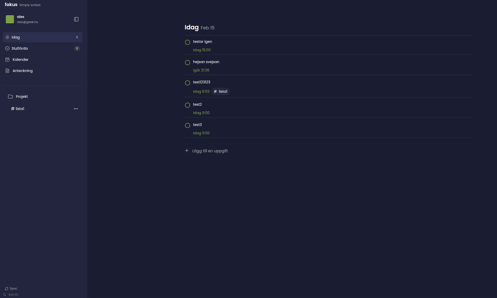

# Fokus

A single-user, self-hosted todo and productivity app built with Next.js.

This project is **heavily based on [Tatsu](https://github.com/ZhengJiawen44/tatsu)** by [@ZhengJiawen44](https://github.com/ZhengJiawen44). Along the way I decided I wasn't interested in hosting this for other people, so I forked it and started reshaping it for my own personal use — adding CalDAV sync, removing features I didn't need, and tailoring the whole thing to a single-user setup. I'll probably steer it even further from the original over time. All credit for making this possible goes to ZhengJiawen44.



## Features

- **Tasks** with drag-and-drop reordering, priorities, projects, and natural language date input ("tomorrow at 5pm")
- **Recurring tasks** (RFC 5545 RRULE) with per-instance editing
- **Calendar view** (month/week/day)
- **Notes** with a Tiptap rich-text editor
- **Projects** with color coding
- **CalDAV sync** — bidirectional sync with CalDAV servers (tested with Baikal), supports both VTODO and VEVENT, Basic and Digest auth
- **Admin panel** at `/admin` for user setup, password reset, and data management
- **Internationalization** — ar, de, en, es, fr, it, ja, ms, pt, ru, sv, zh
- **Dark mode**

## Differences from Tatsu

- Removed public registration — user is created via the admin panel
- Removed Vault / S3 / file encryption
- Removed feedback system and popups
- Switched from PostgreSQL to SQLite
- Added CalDAV sync engine
- Added admin panel (password-protected, separate from user auth)
- Single-user model throughout

## Requirements

- Node.js 18+
- npm

## Setup

### 1. Clone and install

```bash
git clone https://github.com/klppl/fokus.git
cd fokus
npm install
```

### 2. Configure environment

```bash
cp .env.example .env
```

Edit `.env` and fill in the required values:

| Variable | Required | Description |
|---|---|---|
| `AUTH_SECRET` | Yes | `openssl rand -base64 32` |
| `DATABASE_URL` | Yes | SQLite path, e.g. `file:./dev.db` |
| `ADMIN_PASSWORD` | Yes | Password for the admin panel at `/admin` |
| `NEXTAUTH_URL` | Yes | App URL, e.g. `http://localhost:3000` |
| `API_URL` | Yes | API base, e.g. `http://localhost:3000/api` |
| `CRONJOB_SECRET` | Yes | `openssl rand -base64 32` |
| `CALDAV_ENCRYPTION_KEY` | No | 64-char hex for CalDAV password encryption (`openssl rand -hex 32`) |
| `CALDAV_CRON_SECRET` | No | Secret for CalDAV sync cron endpoint |

### 3. Initialize the database

```bash
npm run db:push
```

### 4. Run

**Development:**

```bash
npm run dev
```

**Production:**

```bash
npm run build
npm run start
```

Open `http://localhost:3000`. You'll be redirected to `/admin` to create your user account on first run.

## Docker

Pull and run the prebuilt image from GitHub Container Registry:

```bash
docker run -d \
  --name fokus \
  -p 3000:3000 \
  --env-file .env \
  -e DATABASE_URL=file:./data/fokus.db \
  -v fokus_data:/app/data \
  --restart unless-stopped \
  ghcr.io/klppl/fokus:latest
```

Or use docker compose:

```bash
docker compose up -d
```

The database is stored in a persistent volume. Make sure your `.env` has all required variables set (see the table above).

## Project structure

```
app/
  [locale]/              Locale-routed pages
    (auth)/              Login page
    admin/               Admin panel
    app/                 Main app (auth-gated)
  api/                   REST API routes
components/              React components
features/                Feature-specific logic
lib/                     Utilities, Prisma client, CalDAV sync engine
messages/                i18n translation files
prisma/
  schema.sqlite.prisma   Database schema (source of truth)
```

## Tech stack

Next.js 15 (App Router) · React 18 · TypeScript · Prisma (SQLite) · Tailwind CSS · shadcn/ui · TanStack Query · NextAuth.js v5 · next-intl · Tiptap · chrono-node · tsdav

## License

See upstream [Tatsu](https://github.com/ZhengJiawen44/tatsu) for license information.
